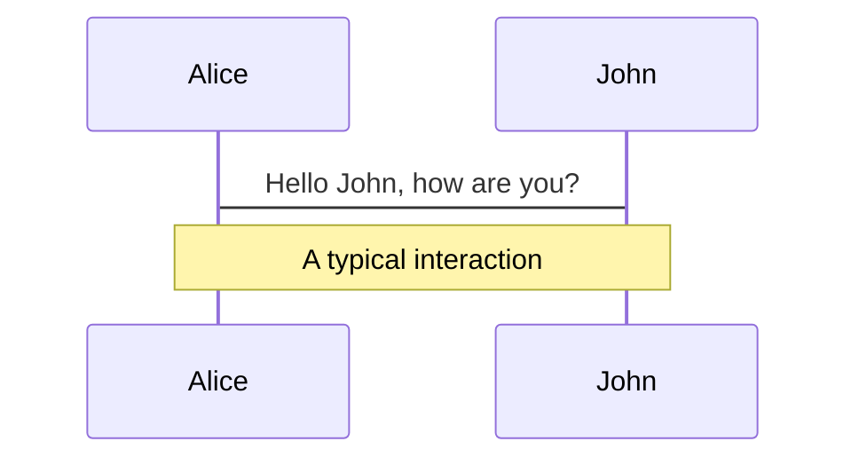
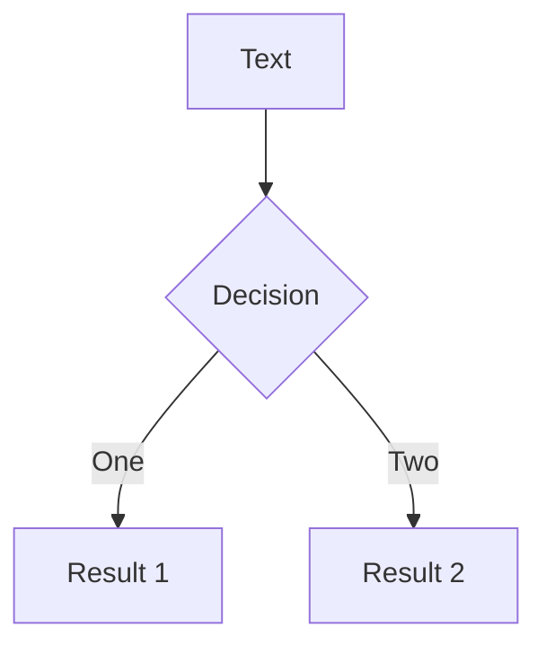
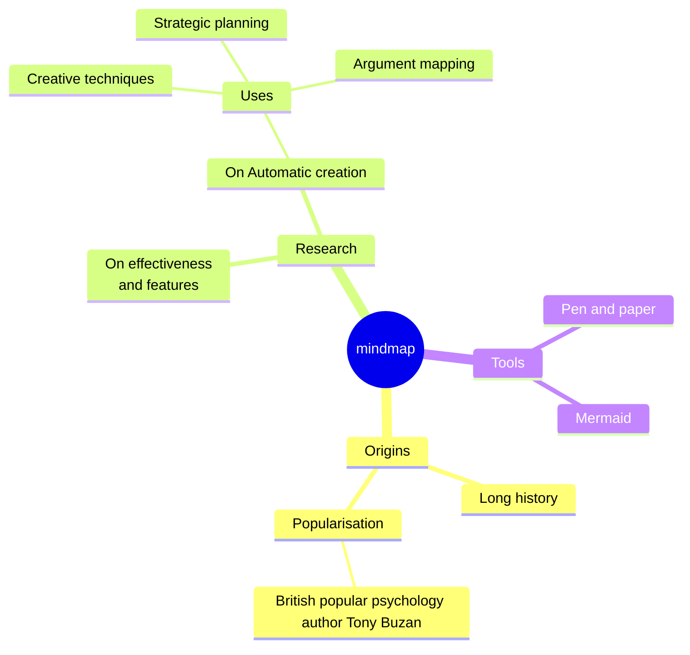
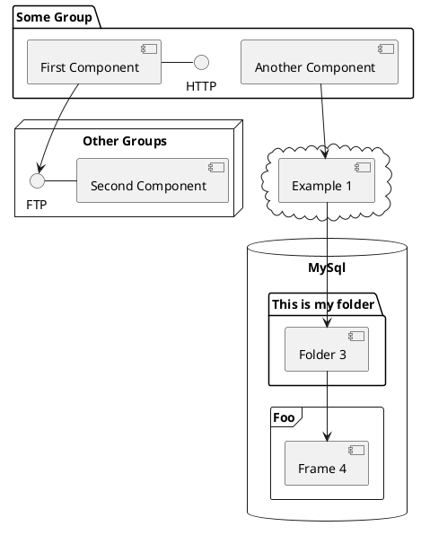

---
# try also 'default' to start simple
theme: apple-basic
layout: intro-image
image: 'image-url'
background: https://images.unsplash.com/photo-1498050108023-c5249f4df085?q=80&w=2072&auto=format&fit=crop&ixlib=rb-4.0.3&ixid=M3wxMjA3fDB8MHxwaG90by1wYWdlfHx8fGVufDB8fHx8fA%3D%3D
# https://cover.sli.dev
# some information about your slides, markdown enabled
title: X lessons from PO
info: |
  ## Slidev
  Presentation slides for developers.

  Learn more at [Sli.dev](https://sli.dev)
# apply any unocss classes to the current slide
# class: text-center
# https://sli.dev/custom/highlighters.html
highlighter: shiki
# https://sli.dev/guide/drawing
# drawings:
# persist: false
# slide transition: https://sli.dev/guide/animations#slide-transitions
transition: slide-left
# enable MDC Syntax: https://sli.dev/guide/syntax#mdc-syntax
mdc: true
---

<div class="absolute top-10">
  <span class="font-700">
    Artem Sakhatskiy, somewhere in Greece
  </span>
</div>

<div class="absolute bottom-10">
  <h1>X things about Development</h1>
  <p>I've learned while being a Product Owner</p>
</div>

<!--
Hey everyone, I'm Artem, and here we are, gathered together to chat about software development.
Now, I know we're all friends here, so if you have a question, just raise your hand -- I'll be answering them pretty regularly.

As someone who's been in the world of software development as both a developer and a product owner, I've gotta say, it has affected drastically on how I develop products.

So, today, I thought it'd be cool to share with you all some of the juiciest insights I've picked up. We're talking about the stuff they don't teach you on CodeAcademy — the lessons learned from being in the trenches.

Now, let's kick back, relax, and explore these nuggets of wisdom together. Get ready for some laughs, some "aha" moments, and maybe even a few head nods of agreement.

Sound good? Alrighty then, let's set sail!
-->

---
transition: fade-out
layout: center
---

# What were my responsibilities?

<div class="pt-10">
<v-clicks>

  - 🛠💻 **Hacking the product**
  - 🤹🧑 **Meeting clients**
  - 📈💰 **Owning P&L**
  - 🔮🧙 **Vision discovery**

</v-clicks>
</div>

<!--
So, what were my responsibilities?

[click] First there was the exciting task of hacking the product—of rolling up my sleeves and diving headfirst into the world of data, UX, and code. From brainstorming new features and troubleshooting bugs to collaborating with new subcontractors and external design teams, every day spent tinkering with the product was a lesson on it's own.
 
[click] Then, I had the privilege of meeting with clients—individuals from organizations whom we could help with our product. These meetings were more than just discussions; they were opportunities to understand needs, and to build (or ruin) relationships grounded in trust and collaboration.

[click] But meeting clients was just the beginning. I also had the responsibility for the profits and losses, being entrusted with the financial health and prosperity of our product. It was a responsibility that demanded foresight, strategic thinking, and a keen eye for opportunity -- all of which I somewhat lacked at the beginning. Yet, it was also a privilege—a testament to the trust placed in me by my team and stakeholders.

[click] But perhaps my most at time undervalued responsibility was that of vision discovery. With time passing we've expanded our core product with supportive add-ons, which later grew into separate products. More product owners joined our team, and more teams spawned, so we had to have a concise vision that would help all of us to align.
-->

---
layout: fact
---

<h2 style="font-size: 44px; line-height:50px">Plans are worthless, <br/><span style="color:transparent">re-</span>planning is essential</h2>

Lesson I

<!--
Alright, let's explore a timeless lesson in software development: the nature of plans and planning.

Now, that's a common thing still worth repeating.

Plans feel like a map—they give you a sense of direction and guide you, but they're not set in stone. In the ever-changing landscape of software development, sticking too rigidly to a plan can be a recipe for disaster.
-->

---
layout: image
image: "https://i.redd.it/hnrt2uupp3d11.jpg"
---

<!--
That's where planning comes in. Planning is not just about creating a static document and following it blindly—it's about the process of thinking, strategizing, and preparing for the challenges and opportunities that lie ahead.

By engaging in the planning process, you're not just outlining a series of steps to follow—you're also cultivating a mindset of adaptability and resilience. You're anticipating potential roadblocks and devising contingency plans to overcome them. You're collaborating with your team to brainstorm creative solutions and iterate on your approach as needed.

But here's the kicker: no matter how meticulously you plan, things will inevitably go south. Requirements will change, deadlines will shift, clients will drop out, and unexpected obstacles will crop up when you least expect them.
-->

---
layout: fact
---

<h2 style="font-size: 44px; line-height:50px">Plans are worthless, <br/><span v-click v-mark.red>re-</span>planning is essential</h2>

Lesson I

<!--
And that's where the true value of planning comes into play. It's not about sticking to a rigid plan no matter what—it's about being prepared to pivot and adapt when the situation calls for it. It's about having the flexibility to overcome uncertainty and turn challenges into opportunities.

So, the next time you find yourself knee-deep in the planning process, remember: plans are useless, planning is important, but re-planning is essential. Embrace the process, stay agile, and be prepared to roll.
-->

---
layout: fact
---

<h2 style="font-size: 44px; line-height:50px">Build to throw away</h2>
Lesson II

<!--
Having learned one of the ways of adaptability, 

Alright, folks, let's talk about one of the golden rules of software development: building in a way that you can easily throw away. Now, I know what you're probably thinking: "Wait, why would I want to throw away something I've spent time and resources building?" Bear with me, and I'll explain.

Change is the only constant. Requirements shift, technology evolves, and user feedback can send you back to the drawing board in one emial. So, it's crucial to adopt a mindset of flexibility and adaptability in your development process.

Instead of clinging to your code like a shipwreck survivor to a raft, think of it more as a draft.

You want your code to be modular, scalable, and easy to dismantle and rearrange if needed. This means writing clean, well-documented code, embracing design patterns and best practices, and avoiding tightly-coupled dependencies like the plague.

By building with the mindset of "throwing away," you're not only future-proofing your codebase but also empowering your team to innovate and iterate with confidence. Need to pivot direction? No problem, you've built your code in a way that allows for seamless transitions and minimal disruption.

Now, I'm not saying you should be reckless and toss out your code willy-nilly at the first sign of trouble. No, it's about being proactive and intentional in your development approach. Think of it as building a sturdy foundation for a house—you want it to withstand the test of time and weather any storm that comes your way.

So, the next time you sit down to write some code, ask yourself: Is this something I can easily throw away and rebuild if needed? If the answer is yes, then you're on the right track to building software that's not just robust but also adaptable to whatever the future may hold.
-->

---
layout: two-cols
layoutClass: gap-16
---

# Table of contents

You can use the `Toc` component to generate a table of contents for your slides:

```html
<Toc minDepth="1" maxDepth="1"></Toc>
```

The title will be inferred from your slide content, or you can override it with `title` and `level` in your frontmatter.

::right::

<Toc v-click minDepth="1" maxDepth="2"></Toc>

---
layout: image-right
image: https://cover.sli.dev
---

# Code

Use code snippets and get the highlighting directly, and even types hover![^1]

```ts {all|5|7|7-8|10|all} twoslash
// TwoSlash enables TypeScript hover information
// and errors in markdown code blocks
// More at https://shiki.style/packages/twoslash

import { computed, ref } from 'vue'

const count = ref(0)
const doubled = computed(() => count.value * 2)

doubled.value = 2
```

<arrow v-click="[4, 5]" x1="350" y1="310" x2="195" y2="334" color="#953" width="2" arrowSize="1" />

<!-- This allow you to embed external code blocks -->
<<< @/snippets/external.ts#snippet

<!-- Footer -->
[^1]: [Learn More](https://sli.dev/guide/syntax.html#line-highlighting)

<!-- Inline style -->
<style>
.footnotes-sep {
  @apply mt-5 opacity-10;
}
.footnotes {
  @apply text-sm opacity-75;
}
.footnote-backref {
  display: none;
}
</style>

<!--
Notes can also sync with clicks

[click] This will be highlighted after the first click

[click] Highlighted with `count = ref(0)`

[click:3] Last click (skip two clicks)
-->

---
level: 2
---

# Shiki Magic Move

Powered by [shiki-magic-move](https://shiki-magic-move.netlify.app/), Slidev supports animations across multiple code snippets.

Add multiple code blocks and wrap them with <code>````md magic-move</code> (four backticks) to enable the magic move. For example:

````md magic-move
```ts {*|2|*}
// step 1
const author = reactive({
  name: 'John Doe',
  books: [
    'Vue 2 - Advanced Guide',
    'Vue 3 - Basic Guide',
    'Vue 4 - The Mystery'
  ]
})
```

```ts {*|1-2|3-4|3-4,8}
// step 2
export default {
  data() {
    return {
      author: {
        name: 'John Doe',
        books: [
          'Vue 2 - Advanced Guide',
          'Vue 3 - Basic Guide',
          'Vue 4 - The Mystery'
        ]
      }
    }
  }
}
```

```ts
// step 3
export default {
  data: () => ({
    author: {
      name: 'John Doe',
      books: [
        'Vue 2 - Advanced Guide',
        'Vue 3 - Basic Guide',
        'Vue 4 - The Mystery'
      ]
    }
  })
}
```

Non-code blocks are ignored.

```vue
<!-- step 4 -->
<script setup>
const author = {
  name: 'John Doe',
  books: [
    'Vue 2 - Advanced Guide',
    'Vue 3 - Basic Guide',
    'Vue 4 - The Mystery'
  ]
}
</script>
```
````

---

# Components

<div grid="~ cols-2 gap-4">
<div>

You can use Vue components directly inside your slides.

We have provided a few built-in components like `<Tweet/>` and `<Youtube/>` that you can use directly. And adding your custom components is also super easy.

```html
<Counter :count="10" />
```

<!-- ./components/Counter.vue -->
<Counter :count="10" m="t-4" />

Check out [the guides](https://sli.dev/builtin/components.html) for more.

</div>
<div>

```html
<Tweet id="1390115482657726468" />
```

<Tweet id="1390115482657726468" scale="0.65" />

</div>
</div>

<!--
Presenter note with **bold**, *italic*, and ~~striked~~ text.

Also, HTML elements are valid:
<div class="flex w-full">
  <span style="flex-grow: 1;">Left content</span>
  <span>Right content</span>
</div>
-->

---
class: px-20
---

# Themes

Slidev comes with powerful theming support. Themes can provide styles, layouts, components, or even configurations for tools. Switching between themes by just **one edit** in your frontmatter:

<div grid="~ cols-2 gap-2" m="t-2">

```yaml
---
theme: default
---
```

```yaml
---
theme: seriph
---
```


</div>

Read more about [How to use a theme](https://sli.dev/themes/use.html) and
check out the [Awesome Themes Gallery](https://sli.dev/themes/gallery.html).

---

# Clicks Animations

You can add `v-click` to elements to add a click animation.

<div v-click>

This shows up when you click the slide:

```html
<div v-click>This shows up when you click the slide.</div>
```

</div>

<br>

<v-click>

The <span v-mark.red="3"><code>v-mark</code> directive</span>
also allows you to add
<span v-mark.circle.orange="4">inline marks</span>
, powered by [Rough Notation](https://roughnotation.com/):

```html
<span v-mark.underline.orange>inline markers</span>
```

</v-click>

<div mt-20 v-click>

[Learn More](https://sli.dev/guide/animations#click-animations)

</div>

---

# Motions

Motion animations are powered by [@vueuse/motion](https://motion.vueuse.org/), triggered by `v-motion` directive.

```html
<div
  v-motion
  :initial="{ x: -80 }"
  :enter="{ x: 0 }"
  :click-3="{ x: 80 }"
  :leave="{ x: 1000 }"
>
  Slidev
</div>
```

<div class="w-60 relative">
  <div class="relative w-40 h-40">
    
    
    
  </div>

  <div
    class="text-5xl absolute top-14 left-40 text-[#2B90B6] -z-1"
    v-motion
    :initial="{ x: -80, opacity: 0}"
    :enter="{ x: 0, opacity: 1, transition: { delay: 2000, duration: 1000 } }">
    Slidev
  </div>
</div>

<!-- vue script setup scripts can be directly used in markdown, and will only affects current page -->
<script setup lang="ts">
const final = {
  x: 0,
  y: 0,
  rotate: 0,
  scale: 1,
  transition: {
    type: 'spring',
    damping: 10,
    stiffness: 20,
    mass: 2
  }
}
</script>

<div
  v-motion
  :initial="{ x:35, y: 30, opacity: 0}"
  :enter="{ y: 0, opacity: 1, transition: { delay: 3500 } }">

[Learn More](https://sli.dev/guide/animations.html#motion)

</div>

---

# LaTeX

LaTeX is supported out-of-box powered by [KaTeX](https://katex.org/).

<br>

Inline $\sqrt{3x-1}+(1+x)^2$

Block
$$ {1|3|all}
\begin{array}{c}

\nabla \times \vec{\mathbf{B}} -\, \frac1c\, \frac{\partial\vec{\mathbf{E}}}{\partial t} &
= \frac{4\pi}{c}\vec{\mathbf{j}}    \nabla \cdot \vec{\mathbf{E}} & = 4 \pi \rho \\

\nabla \times \vec{\mathbf{E}}\, +\, \frac1c\, \frac{\partial\vec{\mathbf{B}}}{\partial t} & = \vec{\mathbf{0}} \\

\nabla \cdot \vec{\mathbf{B}} & = 0

\end{array}
$$

<br>

[Learn more](https://sli.dev/guide/syntax#latex)

---

# Diagrams

You can create diagrams / graphs from textual descriptions, directly in your Markdown.

<div class="grid grid-cols-4 gap-5 pt-4 -mb-6">









</div>

[Learn More](https://sli.dev/guide/syntax.html#diagrams)

---
foo: bar
dragPos:
  square: 691,33,167,_,-16
---

# Draggable Elements

Double-click on the draggable elements to edit their positions.

<br>

###### Directive Usage

```md

```

<br>

###### Component Usage

```md
<v-drag text-3xl>
  <carbon:arrow-up />
  Use the `v-drag` component to have a draggable container!
</v-drag>
```

<v-drag pos="671,205,253,_,-15">
  <div text-center text-3xl border border-main rounded>
    Double-click me!
  </div>
</v-drag>


---
src: ./pages/multiple-entries.md
hide: false
---

---

# Monaco Editor

Slidev provides built-in Monaco Editor support.

Add `{monaco}` to the code block to turn it into an editor:

```ts {monaco}
import { ref } from 'vue'
import { emptyArray } from './external'

const arr = ref(emptyArray(10))
```

Use `{monaco-run}` to create an editor that can execute the code directly in the slide:

```ts {monaco-run}
import { version } from 'vue'
import { emptyArray, sayHello } from './external'

sayHello()
console.log(`vue ${version}`)
console.log(emptyArray<number>(10).reduce(fib => [...fib, fib.at(-1)! + fib.at(-2)!], [1, 1]))
```

---
layout: center
class: text-center
---

# Learn More

[Documentations](https://sli.dev) · [GitHub](https://github.com/slidevjs/slidev) · [Showcases](https://sli.dev/showcases.html)
