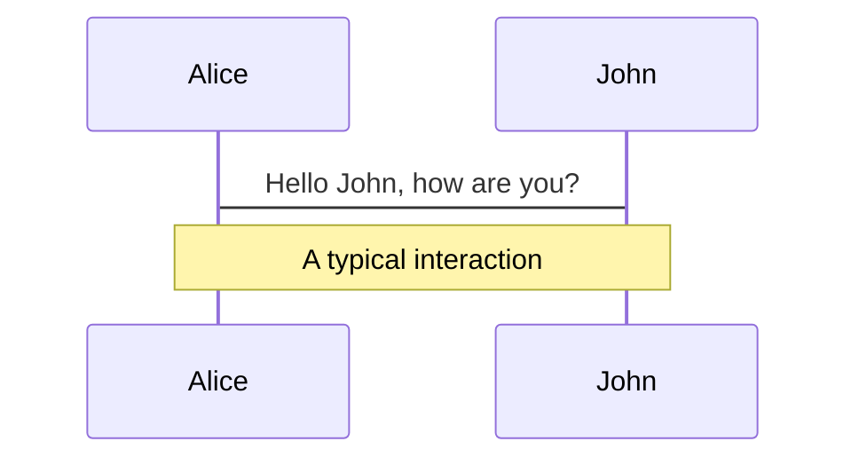
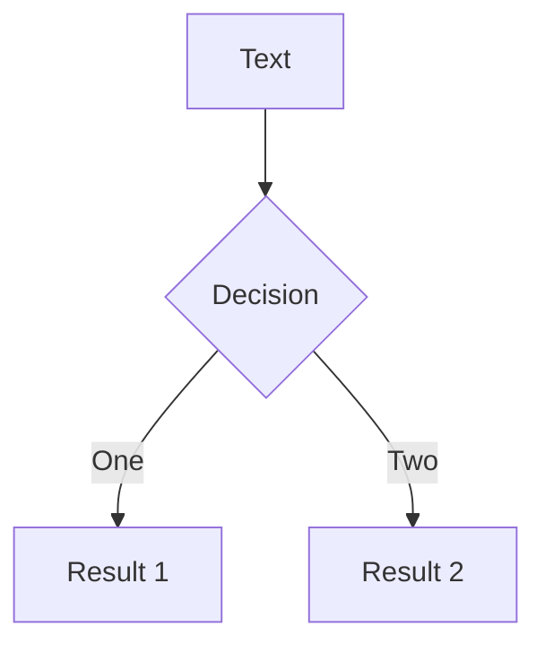
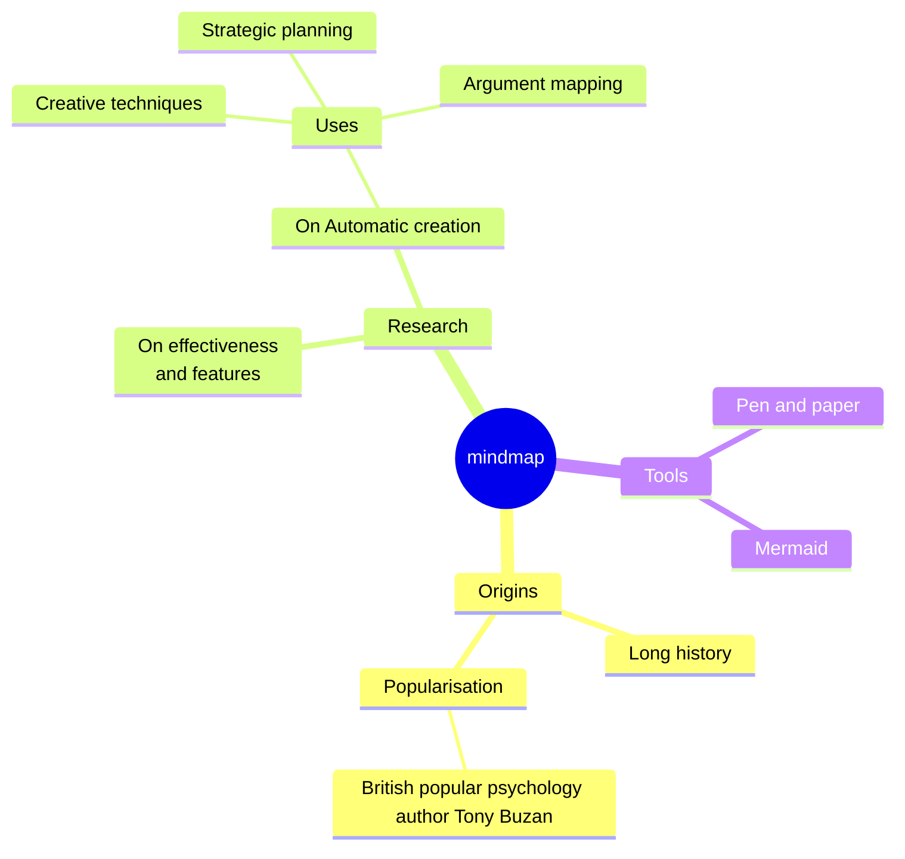
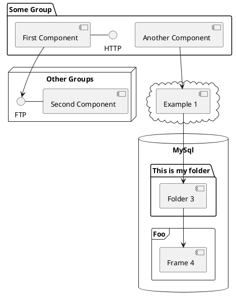

---
# try also 'default' to start simple
theme: apple-basic
layout: intro-image
image: 'image-url'
background: https://images.unsplash.com/photo-1498050108023-c5249f4df085?q=80&w=2072&auto=format&fit=crop&ixlib=rb-4.0.3&ixid=M3wxMjA3fDB8MHxwaG90by1wYWdlfHx8fGVufDB8fHx8fA%3D%3D
# https://cover.sli.dev
# some information about your slides, markdown enabled
title: X lessons from PO
info: |
  ## Slidev
  Presentation slides for developers.

  Learn more at [Sli.dev](https://sli.dev)
# apply any unocss classes to the current slide
# class: text-center
# https://sli.dev/custom/highlighters.html
highlighter: shiki
# https://sli.dev/guide/drawing
# drawings:
# persist: false
# slide transition: https://sli.dev/guide/animations#slide-transitions
transition: slide-left
# enable MDC Syntax: https://sli.dev/guide/syntax#mdc-syntax
mdc: true
---

<div class="absolute top-10">
  <span class="font-700">
    Artem Sakhatskiy, somewhere in Greece
  </span>
</div>

<div class="absolute bottom-10">
  <h1>X things about Development</h1>
  <p>I've learned while being a Product Owner</p>
</div>

<!--
Hey everyone, I'm Artem, and here we are, gathered together to chat about software development.
Now, I know we're all friends here, so if you have a question, just raise your hand -- I'll be answering them pretty regularly.

As someone who's been in the world of software development as both a developer and a product owner, I've gotta say, it has affected drastically on how I develop products.

So, today, I thought it'd be cool to share with you all some of the juiciest insights I've picked up. We're talking about the stuff they don't teach you on CodeAcademy — the lessons learned from being in the trenches.

Now, let's kick back, relax, and explore these nuggets of wisdom together. Get ready for some laughs, some "aha" moments, and maybe even a few head nods of agreement.

Sound good? Alrighty then, let's set sail!
-->

---
transition: fade-out
layout: center
---

# What were my responsibilities?

<div class="pt-10">
<v-clicks>

  - 🛠💻 **Hacking the product**
  - 🤹🧑 **Meeting clients**
  - 📈💰 **Owning P&L**
  - 🔮🧙 **Vision discovery**

</v-clicks>
</div>

<!--
So, what were my responsibilities?

[click] First there was the exciting task of hacking the product—of rolling up my sleeves and diving headfirst into the world of data, UX, and code. From brainstorming new features and troubleshooting bugs to collaborating with new subcontractors and external design teams, every day spent tinkering with the product was a lesson on it's own.
 
[click] Then, I had the privilege of meeting with clients—individuals from organizations whom we could help with our product. These meetings were more than just discussions; they were opportunities to understand needs, and to build (or ruin) relationships grounded in trust and collaboration.

[click] But meeting clients was just the beginning. I also had the responsibility for the profits and losses, being entrusted with the financial health and prosperity of our product. It was a responsibility that demanded foresight, strategic thinking, and a keen eye for opportunity -- all of which I somewhat lacked at the beginning. Yet, it was also a privilege—a testament to the trust placed in me by my team and stakeholders.

[click] But perhaps my most at time undervalued responsibility was that of vision discovery. With time passing we've expanded our core product with supportive add-ons, which later grew into separate products. More product owners joined our team, and more teams spawned, so we had to have a concise vision that would help all of us to align.
-->

---
layout: fact
---

<h2 style="font-size: 44px; line-height:50px">Plans are worthless, <br/><span style="color:transparent">re-</span>planning is essential</h2>

Lesson I

<!--
Alright, let's explore a timeless lesson in software development: the nature of plans and planning.

Now, that's a common thing still worth repeating.

Plans feel like a map—they give you a sense of direction and guide you, but they're not set in stone. In the ever-changing landscape of software development, sticking too rigidly to a plan can be a recipe for disaster.
-->

---
layout: image
image: "https://i.redd.it/hnrt2uupp3d11.jpg"
---

<!--
That's where planning comes in. Planning is not just about creating a static document and following it blindly—it's about the process of thinking, strategizing, and preparing for the challenges and opportunities that lie ahead.

By engaging in the planning process, you're not just outlining a series of steps to follow—you're also cultivating a mindset of adaptability and resilience. You're anticipating potential roadblocks and devising contingency plans to overcome them. You're collaborating with your team to brainstorm creative solutions and iterate on your approach as needed.

But here's the kicker: no matter how meticulously you plan, things will inevitably go south. Requirements will change, deadlines will shift, clients will drop out, and unexpected obstacles will crop up when you least expect them.
-->

---
layout: fact
---

<h2 style="font-size: 44px; line-height:50px">Plans are worthless, <br/><span v-click v-mark.red>re-</span>planning is essential</h2>

Lesson I

<!--
And that's where the true value of planning comes into play. It's not about sticking to a rigid plan no matter what—it's about being prepared to pivot and adapt when the situation calls for it. It's about having the flexibility to overcome uncertainty and turn challenges into opportunities.

So, the next time you find yourself knee-deep in the planning process, remember: plans are useless, planning is important, but re-planning is essential. Embrace the process, stay agile, and be prepared to roll.
-->

---
layout: fact
---

<h2 style="font-size: 44px; line-height:50px">Build to throw away</h2>
Lesson II

<!--
Having learned one of the ways of adaptability, 

Alright, folks, let's talk about one of the golden rules of software development: building in a way that you can easily throw away. Now, I know what you're probably thinking: "Wait, why would I want to throw away something I've spent time and resources building?" Bear with me, and I'll explain.

Change is the only constant. Requirements shift, technology evolves, and user feedback can send you back to the drawing board in one emial. So, it's crucial to adopt a mindset of flexibility and adaptability in your development process.

Instead of clinging to your code like a shipwreck survivor to a raft, think of it more as a draft.

You want your code to be modular, scalable, and easy to dismantle and rearrange if needed. This means writing clean, well-documented code, embracing design patterns and best practices, and avoiding tightly-coupled dependencies like the plague.

By building with the mindset of "throwing away," you're not only future-proofing your codebase but also empowering your team to innovate and iterate with confidence. Need to pivot direction? No problem, you've built your code in a way that allows for seamless transitions and minimal disruption.

Now, I'm not saying you should be reckless and toss out your code willy-nilly at the first sign of trouble. No, it's about being proactive and intentional in your development approach. Think of it as building a sturdy foundation for a house—you want it to withstand the test of time and weather any storm that comes your way.

So, the next time you sit down to write some code, ask yourself: Is this something I can easily throw away and rebuild if needed? If the answer is yes, then you're on the right track to building software that's not just robust but also adaptable to whatever the future may hold.
-->

---
layout: fact
---

<h2 style="font-size: 44px; line-height:50px">Do mistakes, don't blunder</h2>
Lesson III

<!--
Alright, let's tackle the delicate balance between making mistakes and avoiding blunders in the world of software development.

Picture this: You're knee-deep in code, working on a new feature or fixing a pesky bug, when suddenly, oops! You make a mistake. It happens to the best of us, right? But here's the thing: not all mistakes are created equal.

In software development, it's perfectly normal (and even expected) to encounter bumps along the road. After all, we're only human, and coding can be a complex and intricate dance of logic and syntax. But there's a difference between making a mistake and making a blunder.

A mistake might be a typo in your code, a logic error, or forgetting to test a certain edge case. These are the little hiccups that come with the territory, and they're usually easy to spot and fix with a bit of debugging and testing.

On the other hand, a blunder is a mistake on steroids. It's the kind of slip-up that sends shockwaves through your codebase, causing bugs to multiply like rabbits and deadlines to go up in smoke. Think of it as accidentally hitting the self-destruct button instead of the snooze alarm—yikes!

So, how do we avoid blunders while still embracing the inevitability of mistakes? It all comes down to a few key principles:

First, embrace a mindset of continuous improvement. Learn from your mistakes and use them as stepping stones to level up your skills and knowledge. Nobody expects you to be perfect, but they do expect you to learn and grow from your experiences.

Second, practice defensive coding. Write code that's robust, resilient, and resistant to errors. Use automated tests, code reviews, and static analysis tools to catch potential blunders before they wreak havoc on your project.

And finally, know when to ask for help. There's no shame in reaching out to a colleague or mentor when you're stuck or unsure about something. Two heads are better than one, and sometimes a fresh perspective is all you need to avoid a catastrophic blunder.

So, the next time you find yourself face-to-face with a mistake, remember: it's not the end of the world. Learn from it, grow from it, and whatever you do, don't let it escalate into a full-blown blunder. Your codebase—and your sanity—will thank you for it.
-->


---
layout: fact
---

<h2 style="font-size: 44px; line-height:50px">Don't Let Others Fail</h2>
Lesson IV

<!--
Alright, let's delve into a crucial lesson in software development: the importance of supporting and uplifting your team members to prevent failure.

In the high-stakes world of software development, the pressure can sometimes feel like a pressure cooker ready to explode. Tight deadlines, complex problems, and ever-changing requirements can take their toll on even the most seasoned developers.

But here's the thing: you're not in this alone. As a team, your success is intertwined with the success of each and every member. And that means looking out for one another, lending a helping hand when needed, and not letting others fail.

Now, I'm not talking about swooping in like a superhero to save the day every time someone hits a roadblock. No, it's about creating a culture of support and collaboration where everyone feels empowered to ask for help and offer assistance when needed.

So, what does this look like in practice? It means checking in with your teammates regularly, offering encouragement and praise for their hard work, and being willing to step in and lend a hand when someone is struggling.

It also means advocating for resources, tools, and training to help your team succeed. Whether it's investing in better development tools, providing opportunities for professional development, or simply giving someone the time and space they need to recharge and refocus, it's all about setting your team up for success.

And perhaps most importantly, it means leading by example. Show your team what it means to be supportive, empathetic, and collaborative. Celebrate their successes, learn from their failures, and above all, let them know that you've got their back no matter what.

Because at the end of the day, your team is your greatest asset. And by lifting each other up and working together towards a common goal, you'll not only prevent failure but also achieve greatness beyond your wildest dreams.
-->


---
layout: fact
---

<h2 style="font-size: 44px; line-height:50px">Brutal Honesty > Sugarcoating</h2>
Lesson V

<!--
Alright, let's tackle a tough but essential lesson in software development: the value of brutal honesty over polite holdbacks.

Picture this: You're in a meeting, discussing a new feature or project, and someone proposes an idea that just doesn't sit right with you. Maybe it's technically unfeasible, maybe it's not aligned with the project's goals, or maybe it's just plain bad. What do you do?

Well, here's the thing: sugarcoating your feedback might spare someone's feelings in the short term, but in the long run, it can lead to wasted time, missed opportunities, and even project failure.

That's where brutal honesty comes into play. Now, I'm not saying you should be a jerk about it—far from it. But when it comes to giving feedback, especially when it's critical or constructive, it's better to be upfront and transparent than to beat around the bush.

So, how do you practice brutal honesty without burning bridges or bruising egos? It's all about framing your feedback in a constructive and respectful manner. Focus on the facts, provide specific examples or evidence to support your points, and offer suggestions for improvement or alternative solutions.

And remember, it's not just about pointing out what's wrong—it's also about recognizing and acknowledging what's right. If someone on your team has done a stellar job, don't hold back on the praise. Positive reinforcement can be just as powerful as constructive criticism in shaping behavior and driving performance.

By embracing brutal honesty, you're fostering a culture of transparency, accountability, and continuous improvement within your team. You're empowering your colleagues to speak up, challenge the status quo, and push the boundaries of what's possible.

So, the next time you find yourself in a situation where honesty is called for, remember: being polite might spare someone's feelings, but being brutally honest can spare your project from disaster.
-->


---
layout: fact
---

<h2 style="font-size: 44px; line-height:50px">No</h2>
Lesson VI

<!--
Alright, folks, let's dive into our first lesson: being okay with saying "No." Now, I know what you're thinking—saying "No" isn't exactly everyone's favorite word, right? But hear me out.

As a product owner, you're like the gatekeeper to the kingdom of features and functionalities. You're bombarded with requests from stakeholders, users, and even team members, all vying for a piece of your product pie. And let's be real, it's tempting to say "Yes" to everything. After all, you want to make everyone happy, right?

But here's the thing: saying "Yes" to every request can quickly lead you down a rabbit hole of scope creep, missed deadlines, and frustrated developers. Trust me, been there, done that, got the stress-induced headache.

So, what's the solution? Learning to embrace the power of "No." Now, I'm not talking about being a buzzkill and shutting down every idea that comes your way. No, no, no. It's about being strategic and assertive in your decision-making.

When faced with a new feature request or change in scope, ask yourself: Does this align with our product vision? Will it benefit our users? Can we realistically implement it within our timeline and resources? If the answer is "No" to any of these questions, then it's okay to say "No" (politely, of course).

By setting boundaries and managing expectations, you're not only protecting the integrity of your product but also fostering a culture of transparency and accountability within your team. Plus, you'll earn major respect points from your developers for sparing them from unnecessary stress and chaos.

So, the next time you find yourself in a "Yes" or "No" dilemma, remember: it's not about being the bad guy, it's about being a savvy captain steering your ship towards success.
-->


---
layout: fact
---

<h2 style="font-size: 44px; line-height:50px">Test Riskiest Assumptions</h2>
Lesson VII

<!--
Alright, let's talk about the importance of testing the riskiest assumptions in software development.

Imagine you're embarking on a new project or feature. You've got a vision, a plan, and a whole lot of assumptions about how things are going to play out. But here's the thing: assumptions are like the proverbial elephant in the room—they're big, they're powerful, and if left unchecked, they can trample your project into oblivion.

That's where testing comes in. Specifically, testing the riskiest assumptions—the ones that have the potential to sink your project if they turn out to be false.

So, what exactly are these risky assumptions? Well, they're the things you're betting the farm on—the core hypotheses that underpin your project's success. Maybe you're assuming that users will love your new feature, or that your technology stack will scale to meet demand, or that your marketing strategy will attract droves of customers.

Whatever the assumption may be, it's critical to test it early and often. That means gathering real-world data, conducting user interviews, running experiments, and challenging your assumptions at every turn.

Now, I get it—testing assumptions can be scary. What if you uncover a fatal flaw in your plan? What if your assumptions turn out to be dead wrong? Well, here's the thing: it's far better to uncover those flaws early on than to barrel ahead blindly and crash into a brick wall later down the road.

By testing your riskiest assumptions, you're not only mitigating the potential for failure but also laying the foundation for a more robust and resilient project. You're embracing uncertainty and using it as a catalyst for innovation and growth.

So, the next time you find yourself making assumptions, ask yourself: which ones are the riskiest? And what can I do to test them? It might just be the difference between a project that soars and one that crashes and burns.
-->


---
layout: fact
---

<h2 style="font-size: 44px; line-height:50px">Feel Value Delivery</h2>
Lesson VIII

<!--
Alright, let's dive into a critical lesson in product ownership: understanding how your product delivers value.

As a product owner, you're not just responsible for managing features and functionalities—you're also the guardian of your product's value proposition. You need to know what sets your product apart, how it solves problems for your users, and why it matters in the grand scheme of things.

So, what does it mean to know how your product delivers value?

First and foremost, it's about understanding your users inside and out. Who are they? What are their pain points? What are they trying to accomplish? By immersing yourself in the world of your users, you can gain invaluable insights into how your product can make their lives better.

Next, it's about understanding the broader context in which your product operates. What are the market trends? Who are your competitors? What are the regulatory considerations? By staying informed about the external factors that impact your product, you can better position it for success and anticipate potential challenges.

But perhaps most importantly, knowing how your product delivers value means having a deep understanding of your product's unique value proposition. What makes it special? What problem does it solve? What benefits does it offer to your users? By articulating and championing your product's value proposition, you can align your team around a shared vision and inspire them to deliver their best work.

By knowing how your product delivers value, you're not just a product owner—you're a value creator, a problem solver, and a champion for your users. So, the next time you're making decisions about your product, remember to keep the value proposition front and center. Because when you know how your product delivers value, you're not just building software—you're building a better future for your users and your business.
-->


---
layout: fact
---

<h2 style="font-size: 44px; line-height:50px">Don't Bullshit, and Don't Do Shady Stuff</h2>
Lesson IX

<!--
Alright, let's address a straightforward but crucial lesson in software development: integrity and honesty.

In the fast-paced world of technology, it can be tempting to cut corners, bend the truth, or engage in shady practices to meet deadlines or gain a competitive edge. But here's the thing: honesty and integrity are non-negotiables when it comes to building trust and credibility with your team, your users, and your stakeholders.

First and foremost, don't bullshit. Excuse my language, but there's no better way to put it. Be upfront and transparent about the challenges and limitations of your project. If something isn't working or if there's a roadblock that needs addressing, own up to it and communicate openly with your team and stakeholders. Sweeping problems under the rug or sugarcoating the truth might buy you some time in the short term, but it'll inevitably come back to haunt you in the long run.

Secondly, don't do shady stuff. This should go without saying, but it bears repeating. Whether it's manipulating data, plagiarizing code, or engaging in unethical business practices, taking shortcuts or cutting corners will only tarnish your reputation and erode trust with your users and stakeholders. Remember, trust is hard to earn and easy to lose. So, always strive to conduct yourself with integrity and uphold the highest ethical standards in everything you do.

By embracing honesty and integrity in your work, you're not just building software—you're building trust, credibility, and lasting relationships with your team and your community. So, the next time you're faced with a moral dilemma or a temptation to take the easy way out, remember: don't bullshit, and don't do shady stuff. Your conscience—and your reputation—will thank you for it.
-->


---
layout: fact
---


<h2 style="font-size: 44px; line-height:50px">Acknowledge and Celebrate Success</h2>
Lesson X

<!--
Alright, let's wrap up our journey through software development with a lesson that's all about recognizing and appreciating the victories, big and small.

In the fast-paced world of software development, it's easy to get caught up in the never-ending cycle of deadlines, bug fixes, and feature requests. But amidst the chaos, it's important to take a step back and acknowledge the wins—the milestones achieved, the goals reached, and the obstacles overcome.

Why? Because celebrating success isn't just about patting ourselves on the back—it's about fostering a culture of positivity, motivation, and camaraderie within our team. It's about recognizing the hard work, dedication, and ingenuity that goes into every line of code, every design iteration, and every user interaction.

So, how do we acknowledge and celebrate success? Well, it can be as simple as a shoutout in a team meeting, a high-five in the hallway, or a celebratory happy hour at the end of a sprint. It can also be more formal, like a team-wide recognition program, an awards ceremony, or even a company-wide announcement highlighting major achievements.

But regardless of the form it takes, the key is sincerity and authenticity. Celebrate not just the outcomes, but also the effort, the collaboration, and the resilience that led to those outcomes. And don't forget to involve everyone in the celebration—after all, success is a team effort, and everyone deserves to share in the glory.

By acknowledging and celebrating success, we're not just boosting morale and motivation—we're also reinforcing a culture of excellence and achievement that will propel us forward on our journey through software development. So, the next time you achieve a milestone or reach a goal, take a moment to pause, reflect, and celebrate the journey. You've earned it.
-->

---
layout: center
---

As we reach the end of our journey through the world of software development, I hope you've found these ten lessons insightful, inspiring, and perhaps even a bit thought-provoking. From embracing honesty and integrity to celebrating success, each lesson serves as a guiding light on our path towards excellence in our craft.

As product owners, developers, designers, and stakeholders, we are the architects of tomorrow's digital landscape. We hold the power to shape the future, to innovate, and to impact the lives of millions around the globe. But with that power comes great responsibility—the responsibility to lead with integrity, to collaborate with empathy, and to never lose sight of the human element behind the code.

So, as we venture forth into the ever-evolving world of software development, let us carry these lessons with us as beacons of wisdom and inspiration. Let us embrace the challenges, celebrate the victories, and never stop learning and growing along the way.

Together, we can build a future where technology serves humanity, where innovation knows no bounds, and where our collective efforts pave the way for a brighter tomorrow.

Thank you, and may your code be bug-free and your dreams be limitless.

---
layout: image-right
image: https://cover.sli.dev
---

# Code

Use code snippets and get the highlighting directly, and even types hover![^1]

```ts {all|5|7|7-8|10|all} twoslash
// TwoSlash enables TypeScript hover information
// and errors in markdown code blocks
// More at https://shiki.style/packages/twoslash

import { computed, ref } from 'vue'

const count = ref(0)
const doubled = computed(() => count.value * 2)

doubled.value = 2
```

<arrow v-click="[4, 5]" x1="350" y1="310" x2="195" y2="334" color="#953" width="2" arrowSize="1" />

<!-- This allow you to embed external code blocks -->
<<< @/snippets/external.ts#snippet

<!-- Footer -->
[^1]: [Learn More](https://sli.dev/guide/syntax.html#line-highlighting)

<!-- Inline style -->
<style>
.footnotes-sep {
  @apply mt-5 opacity-10;
}
.footnotes {
  @apply text-sm opacity-75;
}
.footnote-backref {
  display: none;
}
</style>

<!--
Notes can also sync with clicks

[click] This will be highlighted after the first click

[click] Highlighted with `count = ref(0)`

[click:3] Last click (skip two clicks)
-->

---
level: 2
---

# Shiki Magic Move

Powered by [shiki-magic-move](https://shiki-magic-move.netlify.app/), Slidev supports animations across multiple code snippets.

Add multiple code blocks and wrap them with <code>````md magic-move</code> (four backticks) to enable the magic move. For example:

````md magic-move
```ts {*|2|*}
// step 1
const author = reactive({
  name: 'John Doe',
  books: [
    'Vue 2 - Advanced Guide',
    'Vue 3 - Basic Guide',
    'Vue 4 - The Mystery'
  ]
})
```

```ts {*|1-2|3-4|3-4,8}
// step 2
export default {
  data() {
    return {
      author: {
        name: 'John Doe',
        books: [
          'Vue 2 - Advanced Guide',
          'Vue 3 - Basic Guide',
          'Vue 4 - The Mystery'
        ]
      }
    }
  }
}
```

```ts
// step 3
export default {
  data: () => ({
    author: {
      name: 'John Doe',
      books: [
        'Vue 2 - Advanced Guide',
        'Vue 3 - Basic Guide',
        'Vue 4 - The Mystery'
      ]
    }
  })
}
```

Non-code blocks are ignored.

```vue
<!-- step 4 -->
<script setup>
const author = {
  name: 'John Doe',
  books: [
    'Vue 2 - Advanced Guide',
    'Vue 3 - Basic Guide',
    'Vue 4 - The Mystery'
  ]
}
</script>
```
````

---

# Components

<div grid="~ cols-2 gap-4">
<div>

You can use Vue components directly inside your slides.

We have provided a few built-in components like `<Tweet/>` and `<Youtube/>` that you can use directly. And adding your custom components is also super easy.

```html
<Counter :count="10" />
```

<!-- ./components/Counter.vue -->
<Counter :count="10" m="t-4" />

Check out [the guides](https://sli.dev/builtin/components.html) for more.

</div>
<div>

```html
<Tweet id="1390115482657726468" />
```

<Tweet id="1390115482657726468" scale="0.65" />

</div>
</div>

<!--
Presenter note with **bold**, *italic*, and ~~striked~~ text.

Also, HTML elements are valid:
<div class="flex w-full">
  <span style="flex-grow: 1;">Left content</span>
  <span>Right content</span>
</div>
-->

---
class: px-20
---

# Themes

Slidev comes with powerful theming support. Themes can provide styles, layouts, components, or even configurations for tools. Switching between themes by just **one edit** in your frontmatter:

<div grid="~ cols-2 gap-2" m="t-2">

```yaml
---
theme: default
---
```

```yaml
---
theme: seriph
---
```


</div>

Read more about [How to use a theme](https://sli.dev/themes/use.html) and
check out the [Awesome Themes Gallery](https://sli.dev/themes/gallery.html).

---

# Clicks Animations

You can add `v-click` to elements to add a click animation.

<div v-click>

This shows up when you click the slide:

```html
<div v-click>This shows up when you click the slide.</div>
```

</div>

<br>

<v-click>

The <span v-mark.red="3"><code>v-mark</code> directive</span>
also allows you to add
<span v-mark.circle.orange="4">inline marks</span>
, powered by [Rough Notation](https://roughnotation.com/):

```html
<span v-mark.underline.orange>inline markers</span>
```

</v-click>

<div mt-20 v-click>

[Learn More](https://sli.dev/guide/animations#click-animations)

</div>

---

# Motions

Motion animations are powered by [@vueuse/motion](https://motion.vueuse.org/), triggered by `v-motion` directive.

```html
<div
  v-motion
  :initial="{ x: -80 }"
  :enter="{ x: 0 }"
  :click-3="{ x: 80 }"
  :leave="{ x: 1000 }"
>
  Slidev
</div>
```

<div class="w-60 relative">
  <div class="relative w-40 h-40">
    
    
    
  </div>

  <div
    class="text-5xl absolute top-14 left-40 text-[#2B90B6] -z-1"
    v-motion
    :initial="{ x: -80, opacity: 0}"
    :enter="{ x: 0, opacity: 1, transition: { delay: 2000, duration: 1000 } }">
    Slidev
  </div>
</div>

<!-- vue script setup scripts can be directly used in markdown, and will only affects current page -->
<script setup lang="ts">
const final = {
  x: 0,
  y: 0,
  rotate: 0,
  scale: 1,
  transition: {
    type: 'spring',
    damping: 10,
    stiffness: 20,
    mass: 2
  }
}
</script>

<div
  v-motion
  :initial="{ x:35, y: 30, opacity: 0}"
  :enter="{ y: 0, opacity: 1, transition: { delay: 3500 } }">

[Learn More](https://sli.dev/guide/animations.html#motion)

</div>

---

# LaTeX

LaTeX is supported out-of-box powered by [KaTeX](https://katex.org/).

<br>

Inline $\sqrt{3x-1}+(1+x)^2$

Block
$$ {1|3|all}
\begin{array}{c}

\nabla \times \vec{\mathbf{B}} -\, \frac1c\, \frac{\partial\vec{\mathbf{E}}}{\partial t} &
= \frac{4\pi}{c}\vec{\mathbf{j}}    \nabla \cdot \vec{\mathbf{E}} & = 4 \pi \rho \\

\nabla \times \vec{\mathbf{E}}\, +\, \frac1c\, \frac{\partial\vec{\mathbf{B}}}{\partial t} & = \vec{\mathbf{0}} \\

\nabla \cdot \vec{\mathbf{B}} & = 0

\end{array}
$$

<br>

[Learn more](https://sli.dev/guide/syntax#latex)

---

# Diagrams

You can create diagrams / graphs from textual descriptions, directly in your Markdown.

<div class="grid grid-cols-4 gap-5 pt-4 -mb-6">









</div>

[Learn More](https://sli.dev/guide/syntax.html#diagrams)

---
foo: bar
dragPos:
  square: 691,33,167,_,-16
---

# Draggable Elements

Double-click on the draggable elements to edit their positions.

<br>

###### Directive Usage

```md

```

<br>

###### Component Usage

```md
<v-drag text-3xl>
  <carbon:arrow-up />
  Use the `v-drag` component to have a draggable container!
</v-drag>
```

<v-drag pos="671,205,253,_,-15">
  <div text-center text-3xl border border-main rounded>
    Double-click me!
  </div>
</v-drag>


---
src: ./pages/multiple-entries.md
hide: false
---

---

# Monaco Editor

Slidev provides built-in Monaco Editor support.

Add `{monaco}` to the code block to turn it into an editor:

```ts {monaco}
import { ref } from 'vue'
import { emptyArray } from './external'

const arr = ref(emptyArray(10))
```

Use `{monaco-run}` to create an editor that can execute the code directly in the slide:

```ts {monaco-run}
import { version } from 'vue'
import { emptyArray, sayHello } from './external'

sayHello()
console.log(`vue ${version}`)
console.log(emptyArray<number>(10).reduce(fib => [...fib, fib.at(-1)! + fib.at(-2)!], [1, 1]))
```

---
layout: center
class: text-center
---

# Learn More

[Documentations](https://sli.dev) · [GitHub](https://github.com/slidevjs/slidev) · [Showcases](https://sli.dev/showcases.html)
